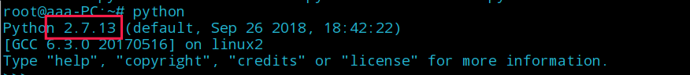
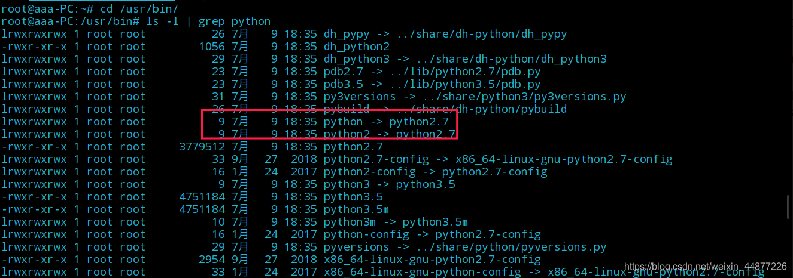
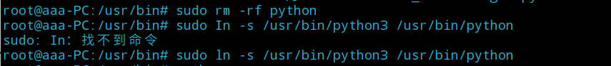
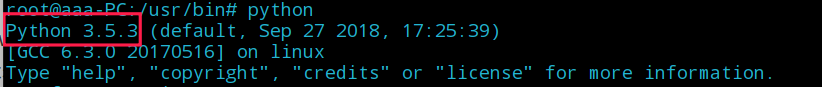

pip install -r requirements.txt
imgaug==0.2.9

报错： imageio requires Python ">=3.5" but the running Python is 2.7.13
==解决方法===
参考链接：https://blog.csdn.net/weixin_44877226/article/details/108400628
Linux里面默认安装的是Python is 2.7.13
需要把Python切换到3以上版本

之后输入：cd /usr/bin/
/usr/bin# ls -l | grep python
查看Python信息

再输入这两个命令：
sudo rm -rf python
sudo ln -s /usr/bin/python3 /usr/bin/python

之后查看一下Python版本

数据集配置
1.下载
CitySpace (需要使用邮箱注册)
下载网址：https://www.cityscapes-dataset.com/downloads/
选择对应的数据集.
leftImg8bit_trainvaltest.zip (11GB) [md5]
left 8-bit images - train, val, and test sets (5000 images)

标注文件Download the processed annotation file ：
https://zjueducn-my.sharepoint.com/personal/pengsida_zju_edu_cn/_layouts/15/onedrive.aspx?id=%2Fpersonal%2Fpengsida%5Fzju%5Fedu%5Fcn%2FDocuments%2Fsnake%2Fcityscapes%5Fanno%2Etar%2Egz&parent=%2Fpersonal%2Fpengsida%5Fzju%5Fedu%5Fcn%2FDocuments%2Fsnake&originalPath=aHR0cHM6Ly96anVlZHVjbi1teS5zaGFyZXBvaW50LmNvbS86dTovZy9wZXJzb25hbC9wZW5nc2lkYV96anVfZWR1X2NuL0VjYUZMM1pMQzVWT3ZSNUh1cE9nSEVNQnl6Z2laMGlMcFBXMHJBYjFpNTdZdHc_cnRpbWU9UF84aEFScXgyRWc

Kitty
数据集：https://s3.eu-central-1.amazonaws.com/avg-kitti/data_object_image_2.zip
标注文件：
Download the annotation file instances_train.json and instances_val.json from Kins.
https://github.com/qqlu/Amodal-Instance-Segmentation-through-KINS-Dataset

SBD
Download the Sbd dataset at here.
https://zjueducn-my.sharepoint.com/personal/pengsida_zju_edu_cn/_layouts/15/onedrive.aspx?id=%2Fpersonal%2Fpengsida%5Fzju%5Fedu%5Fcn%2FDocuments%2Fsnake%2Fsbd%2Etar%2Egz&parent=%2Fpersonal%2Fpengsida%5Fzju%5Fedu%5Fcn%2FDocuments%2Fsnake&originalPath=aHR0cHM6Ly96anVlZHVjbi1teS5zaGFyZXBvaW50LmNvbS86dTovZy9wZXJzb25hbC9wZW5nc2lkYV96anVfZWR1X2NuL0VWMlAtNkowcy1oQ2x3Vzh1WnkxWlhZQlBVMFh3UjdDaDdFQkdPRzJ2ZkFDR1E_cnRpbWU9Wnd4R2xCaXgyRWc

